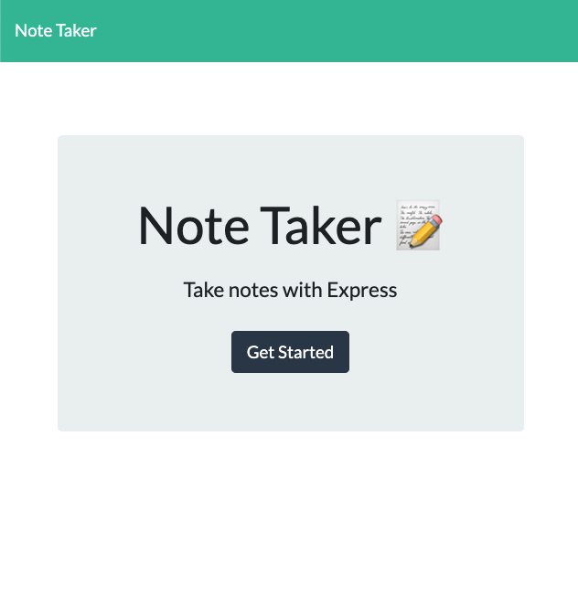
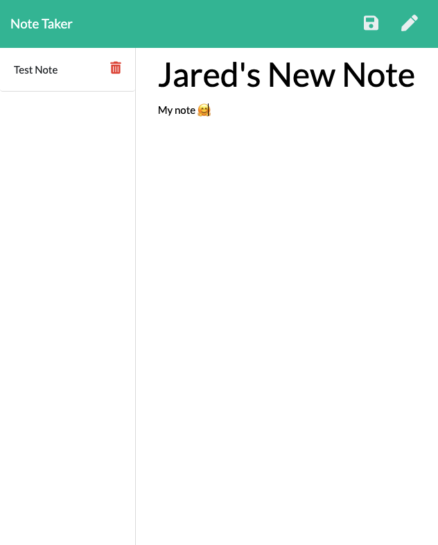

# Note-Taker
## Description
Note Taker, simply, takes notes! This application is stripped down to the essentials needed to efficiently write, store, and return to jotten down notes. 

## Table of Contents
- [Description](#Description)
- [Deployment](#Deployment)
- [Usage](#Usage)
- [Features](#Features)
- [Credits](#Credits)
- [Contributing](#Contributing)
- [License](#License)
  

## Deployment
- [GitHub Repo](https://github.com/jareddeuriarte/note-taker)
  

  
### Usage
- Visit the url, and click 'Get Started' 
- Enter a note title and body.
- Click save!
- Refresh the page to access all saved notes.

### Features
- Node.js techonology
- Note database
 

### Credits  
My tutor Namita.

### Contributing
Forks are welcome!

### License 
This project is licensed under MIT.

### Badges

  
### Questions?
Reach me at:
- [GitHub](https://github.com/jareddeuriarte)
- deuriartejared@gmail.com